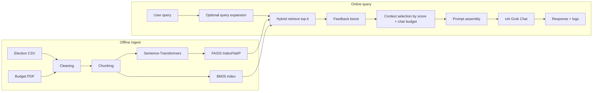

# System architecture — CS4241 RAG (2026)

**Student:** set via `.env` (`STUDENT_NAME`, `STUDENT_INDEX`) — replace in your submission copy.

## Data flow

## Components

| Component | Role |
|-----------|------|
| `scripts/build_index.py` | Downloads sources, cleans text, chunks, embeds, writes `data/processed/index_store/` (FAISS + `chunks.pkl` + `bm25.pkl`). |
| `src/vector_store.py` | FAISS inner-product search on L2-normalized vectors (cosine similarity). |
| `src/bm25.py` | Manual BM25 for sparse scoring. |
| `src/retrieval.py` | Top-k fusion (hybrid) + optional acronym expansion. |
| `src/feedback_store.py` | Innovation: JSON-backed per-chunk score adjustments from UI feedback. |
| `src/prompts.py` | Injects context, enforces grounding / refusal wording by variant. |
| `src/llm.py` | Calls **xAI Grok** using the OpenAI-compatible Python client (`base_url=https://api.x.ai/v1`). |
| `src/rag_pipeline.py` | Orchestrates stages and attaches structured logs. |
| `app.py` | Streamlit UI: toggles, retrieved snippets, full prompt JSON, answer. |

## Why this fits “Academic City assistant” domain

Election CSV rows and national budget prose are **heterogeneous**: hybrid retrieval reduces misses when users switch between **tabular names/figures** (keyword-strong) and **policy narrative** (semantic-strong). Chunk overlap keeps **cross-sentence** references (e.g. a metric and its footnote) co-located in at least one window.

## Operational notes

- Secrets (`XAI_API_KEY` / `GROK_API_KEY`) stay in `.env`, not in Git.  
- Re-run `build_index.py` when sources change.  
- For exam evidence, capture screenshots of retrieval scores, prompt JSON, and RAG vs non-RAG answers in your manual log.
